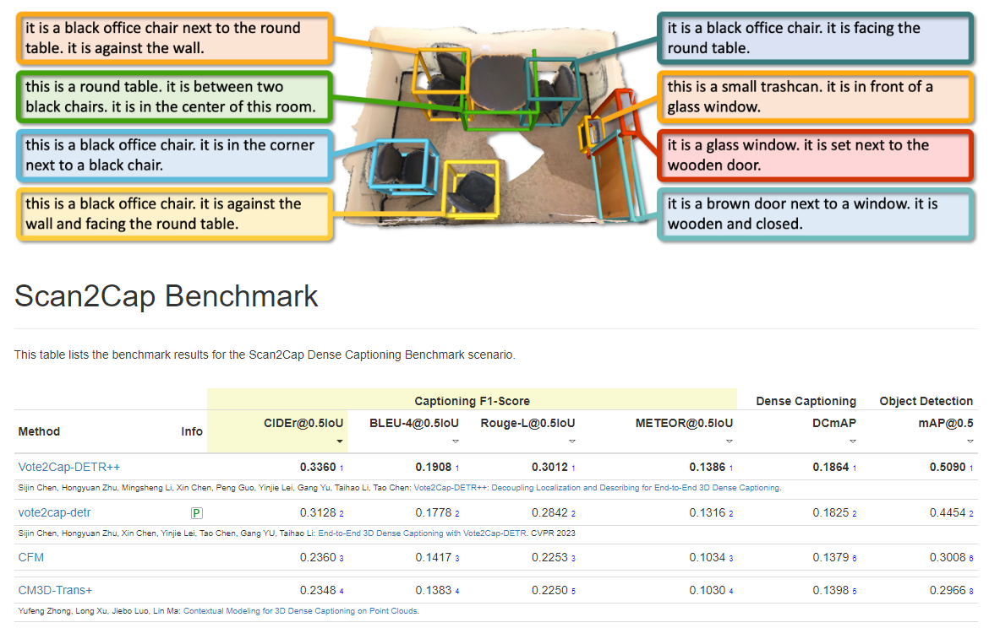

# Vote2Cap-DETR: A Set-to-Set Perspective Towards 3D Dense Captioning

Official implementation of ["End-to-End 3D Dense Captioning with Vote2Cap-DETR"](https://arxiv.org/abs/2301.02508) (CVPR 2023) and ["Vote2Cap-DETR++: Decoupling Localization and Describing for End-to-End 3D Dense Captioning"](https://arxiv.org/abs/2309.02999).


Thanks to the implementation of [3DETR](https://github.com/facebookresearch/3detr), [Scan2Cap](https://github.com/daveredrum/Scan2Cap), and [VoteNet](https://github.com/facebookresearch/votenet).


## 0. News

- 2024-02-21. 💥 Code for [Vote2Cap-DETR++](https://arxiv.org/abs/2309.02999) are released!

- 2024-02-20. 🚩 Vote2Cap-DETR++ reached 1st place on the [Scan2Cap online test benchmark](https://kaldir.vc.in.tum.de/scanrefer_benchmark/benchmark_captioning).

- 2023-10-06. 🚩 Vote2Cap-DETR won the Scan2Cap Challenge in the 3rd Language for 3D Scene Workshop at ICCV 2023.

- 2023-09-07. 📃 We further propose an advanced model, [Vote2Cap-DETR++](https://arxiv.org/pdf/2309.02999.pdf), which decouples the feature extraction for object localization and caption generation.

- 2022-11-17. 🚩 Our model sets a new state-of-the-art on the [Scan2Cap online test benchmark](https://kaldir.vc.in.tum.de/scanrefer_benchmark/benchmark_captioning).




## 1. Environment

Our code is tested with PyTorch 1.7.1, CUDA 11.0 and Python 3.8.13.
Besides `pytorch`, this repo also requires the following Python dependencies:

```{bash}
matplotlib
opencv-python
plyfile
'trimesh>=2.35.39,<2.35.40'
'networkx>=2.2,<2.3'
scipy
cython
transformers
```

If you wish to use multi-view feature extracted by [Scan2Cap](https://github.com/daveredrum/Scan2Cap), you should also install `h5py`:

```{bash}
pip install h5py
```

It is also **REQUIRED** to compile the CUDA accelerated PointNet++, and compile gIoU support for fast training:

```{bash}
cd third_party/pointnet2
python setup.py install
```

```{bash}
cd utils
python cython_compile.py build_ext --inplace
```

To build support for METEOR metric for evaluating captioning performance, we also installed the `java` package.


## 2. Dataset Preparation

We follow [Scan2Cap](https://github.com/daveredrum/Scan2Cap)'s procedure to prepare datasets under the `./data` folder (`Scan2CAD` **NOT** required).

**Preparing 3D point clouds from ScanNet**. 
Download the [ScanNetV2 dataset](https://github.com/ch3cook-fdu/Vote2Cap-DETR/tree/master/data/scannet) and change the `SCANNET_DIR` to the `scans` folder in [`data/scannet/batch_load_scannet_data.py`](https://github.com/ch3cook-fdu/Vote2Cap-DETR/blob/master/data/scannet/batch_load_scannet_data.py#L16), and run the following commands.

```
cd data/scannet/
python batch_load_scannet_data.py
```

**Preparing Language Annotations**. 
Please follow [this](https://github.com/daveredrum/ScanRefer) to download the ScanRefer dataset, and put it under `./data`.

[Optional] To prepare for Nr3D, it is also required to [download](https://referit3d.github.io/#dataset) and put the Nr3D under `./data`.
Since it's in `.csv` format, it is required to run the following command to process data.

```{bash}
cd data; python parse_nr3d.py
```

## 3. [Optional] Download Pretrained Weights

You can download all the ready-to-use weights at [huggingface](https://huggingface.co/CH3COOK/Vote2Cap-DETR-weights/tree/main).


|      Model      |     SCST     |      rgb     |  multi-view  |    normal    | checkpoint |
|:---------------:|:------------:|:------------:|:------------:|:------------:|:----------:|
|  Vote2Cap-DETR  |       -      | $\checkmark$ |       -      | $\checkmark$ | [[checkpoint]](https://huggingface.co/CH3COOK/Vote2Cap-DETR-weights/blob/main/vote2cap-detr/scanrefer_vote2cap_detr_XYZ_RGB_NORMAL.pth) |
|  Vote2Cap-DETR  |       -      |       -      | $\checkmark$ | $\checkmark$ | [[checkpoint]](https://huggingface.co/CH3COOK/Vote2Cap-DETR-weights/blob/main/vote2cap-detr/scanrefer_vote2cap_detr_XYZ_MULTIVIEW_NORMAL.pth) |
|  Vote2Cap-DETR  | $\checkmark$ | $\checkmark$ |       -      | $\checkmark$ | [[checkpoint]](https://huggingface.co/CH3COOK/Vote2Cap-DETR-weights/blob/main/vote2cap-detr/scanrefer_scst_vote2cap_detr_XYZ_RGB_NORMAL.pth) |
|  Vote2Cap-DETR  | $\checkmark$ |       -      | $\checkmark$ | $\checkmark$ | [[checkpoint]](https://huggingface.co/CH3COOK/Vote2Cap-DETR-weights/blob/main/vote2cap-detr/scanrefer_scst_vote2cap_detr_XYZ_MULTIVIEW_NORMAL.pth) |
| Vote2Cap-DETR++ |       -      | $\checkmark$ |       -      | $\checkmark$ | [[checkpoint]](https://huggingface.co/CH3COOK/Vote2Cap-DETR-weights/blob/main/vote2cap-detr++/scanrefer_vote2cap_detr_pp_XYZ_RGB_NORMAL.pth) |
| Vote2Cap-DETR++ |       -      |       -      | $\checkmark$ | $\checkmark$ | [[checkpoint]](https://huggingface.co/CH3COOK/Vote2Cap-DETR-weights/blob/main/vote2cap-detr++/scanrefer_vote2cap_detr_pp_XYZ_MULTIVIEW_NORMAL.pth) |
| Vote2Cap-DETR++ | $\checkmark$ | $\checkmark$ |       -      | $\checkmark$ | [[checkpoint]](https://huggingface.co/CH3COOK/Vote2Cap-DETR-weights/blob/main/vote2cap-detr++/scanrefer_scst_vote2cap_detr_pp_XYZ_RGB_NORMAL.pth) |
| Vote2Cap-DETR++ | $\checkmark$ |       -      | $\checkmark$ | $\checkmark$ | [[checkpoint]](https://huggingface.co/CH3COOK/Vote2Cap-DETR-weights/blob/main/vote2cap-detr++/scanrefer_scst_vote2cap_detr_pp_XYZ_MULTIVIEW_NORMAL.pth) |


## 4. Training and Evaluation

Though we provide training commands from scratch, you can also start with some pretrained parameters provided under the `./pretrained` folder and skip certain steps.

**[optional] 4.0 Pre-Training for Detection**

You are free to **SKIP** the following procedures as they are to generate the pre-trained weights in `./pretrained` folder.

To train the Vote2Cap-DETR's detection branch for point cloud input without additional 2D features (aka [xyz + rgb + normal + height]):

```{bash}
bash scripts/vote2cap-detr/train_scannet.sh

# Please also try our updated Vote2Cap-DETR++ model:
bash scripts/vote2cap-detr++/train_scannet.sh
```

To evaluate the pre-trained detection branch on ScanNet:

```{bash}
bash scripts/vote2cap-detr/eval_scannet.sh

# Our updated Vote2Cap-DETR++:
bash scripts/vote2cap-detr++/eval_scannet.sh
```

To train with additional 2D features (aka [xyz + multiview + normal + height]) rather than RGB inputs, you can manually replace `--use_color` to `--use_multiview`.


**4.1 MLE Training for 3D Dense Captioning**

Please make sure there are pretrained checkpoints under the `./pretrained` directory. To train the mdoel for 3D dense captioning with MLE training on ScanRefer:

```{bash}
bash scripts/vote2cap-detr/train_mle_scanrefer.sh

# Our updated Vote2Cap-DETR++:
bash scripts/vote2cap-detr++/train_mle_scanrefer.sh
```

And on Nr3D:

```{bash}
bash scripts/vote2cap-detr/train_mle_nr3d.sh

# Our updated Vote2Cap-DETR++:
bash scripts/vote2cap-detr++/train_mle_nr3d.sh
```

**4.2 Self-Critical Sequence Training for 3D Dense Captioning**

To train the model with Self-Critical Sequence Training (SCST), you can use the following command:

```{cmd}
bash scripts/vote2cap-detr/train_scst_scanrefer.sh

# Our updated Vote2Cap-DETR++:
bash scripts/vote2cap-detr++/train_scst_scanrefer.sh
```

And on Nr3D:

```{bash}
bash scripts/vote2cap-detr/train_scst_nr3d.sh

# Our updated Vote2Cap-DETR++:
bash scripts/vote2cap-detr++/train_scst_nr3d.sh
```

**4.3 Evaluating the Weights**

You can evaluate any trained model with specified **models** and **checkponts**. Change `--dataset scene_scanrefer` to `--dataset scene_nr3d` to evaluate the model for the Nr3D dataset.

```{cmd}
bash scripts/eval_3d_dense_caption.sh
```

Run the following commands to store object predictions and captions for each scene.

```{cmd}
bash scripts/demo.sh
```

## 5. Make Predictions for online test benchmark

Our model also provides the inference code for ScanRefer online test benchmark.

The following command will generate a `.json` file under the folder defined by `--checkpoint_dir`.

```
bash submit.sh
```

## 6. BibTex

If you find our work helpful, please kindly cite our paper:

```
@inproceedings{chen2023end,
  title={End-to-end 3d dense captioning with vote2cap-detr},
  author={Chen, Sijin and Zhu, Hongyuan and Chen, Xin and Lei, Yinjie and Yu, Gang and Chen, Tao},
  booktitle={Proceedings of the IEEE/CVF Conference on Computer Vision and Pattern Recognition},
  pages={11124--11133},
  year={2023}
}

@misc{chen2023vote2capdetr,
  title={Vote2Cap-DETR++: Decoupling Localization and Describing for End-to-End 3D Dense Captioning}, 
  author={Sijin Chen and Hongyuan Zhu and Mingsheng Li and Xin Chen and Peng Guo and Yinjie Lei and Gang Yu and Taihao Li and Tao Chen},
  year={2023},
  eprint={2309.02999},
  archivePrefix={arXiv},
  primaryClass={cs.CV}
}
```

## 7. License

Vote2Cap-DETR and Vote2Cap-DETR++ are both licensed under a [MIT License](LICENSE).

## 8. Contact

If you have any questions or suggestions regarding this repo, please feel free to open issues!


